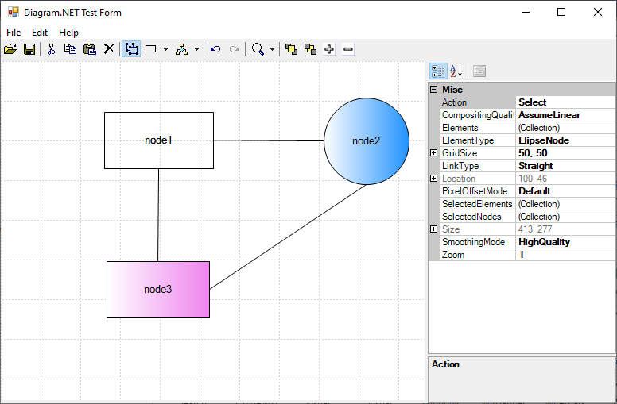

# Diagram.NET
_Diagram.NET_ is a free open-source diagramming tools written entirely in C#.



Put _Diagram.NET_ WinForm Control into your form and, like Microsoft Visio®,
the user can draw shapes and links. With some code you can control, change,
add and delete these elements.

## Background
<details>

This would appear to have been a reasonably popular diagramming control
for _WinForms_ development.

Unfortunately, the [company](http://www.dalssoft.com/) behind this component is now defunct.
Technology has moved on and this component is now not compatible with .NET Core.
The source code is not available, so there is no way to make this component compatible.

Further, the last available [source](https://github.com/dalssoft/diagramnet.git) is v0.4
whereas the last available binary is at v0.5

[JetBrains dotPeek](https://www.jetbrains.com/decompiler/) is a .NET decompiler and assembly browser.
This has allowed us to decompile the component and make it compatible with newer technologies.

</details>

# Prerequisites
* .NET Core 6.0
* Windows

# Getting started
```bash
$ git clone https://github.com/TrevorDArcyEvans/DiagramNet.git
$ cd DiagramNet
$ dotnet restore
$ dotnet build

# run test app
$ dotnet run --project TestForm/TestForm.csproj
```

# Breaking changes for migration from .NET Framework to .NET Core
<details>

* https://docs.microsoft.com/en-gb/dotnet/core/compatibility/fx-core#recommended-action

* .NET Core 3.1
  * Removed controls

Starting in .NET Core 3.1, some Windows Forms controls are no longer available.

Each removed control has a recommended replacement control. Refer to the following table:

| Removed control (API) | Recommended replacement | Associated APIs that are removed |
|-----------------------|-------------------------|----------------------------------|
| ContextMenu | ContextMenuStrip ||
| DataGrid | DataGridView | DataGridCell, DataGridRow, DataGridTableCollection, DataGridColumnCollection, DataGridTableStyle, DataGridColumnStyle, DataGridLineStyle, DataGridParentRowsLabel, DataGridParentRowsLabelStyle, DataGridBoolColumn, DataGridTextBox, GridColumnStylesCollection, GridTableStylesCollection, HitTestType |
| MainMenu | MenuStrip ||
| Menu | ToolStripDropDown, ToolStripDropDownMenu | MenuItemCollection |
| MenuItem | ToolStripMenuItem ||
| ToolBar | ToolStrip | ToolBarAppearance |
| ToolBarButton | ToolStripButton | ToolBarButtonClickEventArgs, ToolBarButtonClickEventHandler, ToolBarButtonStyle, ToolBarTextAlign |


* [StatusBarPanelAutoSize Enum](https://docs.microsoft.com/en-us/dotnet/api/system.windows.forms.statusbarpanelautosize?view=netframework-4.8&viewFallbackFrom=net-6.0)

</details>

# TODO
* ~~port to .NET Core 6~~
* ~~fix test app~~
* ~~test round trip serialisation~~
* ~~company+author+copyright credits~~

# Further work
* finish integration of _DocumentBlock_

